<!-- Dynamic typing header -->

<!-- Food-themed subtitle -->

Serving code with a side of creativity

---

<!-- Two-column layout for stats -->
<table width="100%">
  <tr>
    <td width="55%" valign="top">

### 🍳 Cooking Up Code

I use food as my name—call me **Taco**, **EggTarts**, **Ice Cream**, or whatever delicious thing comes to mind. My human name is **Freya** (for now).

- 🔭 Currently building things that matter
- 🌱 Always learning, always hungry
- 📫 Best reached by email
- ⚡ Fun fact: My commit history looks like a recipe book

    </td>
    <td width="45%" valign="top">

<!-- GitHub Stats with dark/light mode support -->
<picture>
  <source
    srcset="https://github-readme-stats.vercel.app/api?username=ann61c&show_icons=true&rank_icon=github&theme=github_dark&hide_border=true&bg_color=00000000&card_width=400"
    media="(prefers-color-scheme: dark)"
  />
  <source
    srcset="https://github-readme-stats.vercel.app/api?username=ann61c&show_icons=true&rank_icon=github&theme=graywhite&hide_border=true&bg_color=00000000&card_width=400"
    media="(prefers-color-scheme: light), (prefers-color-scheme: no-preference)"
  />
  
</picture>

    </td>
  </tr>
</table>

---

### 🥢 Language Palette

<!-- Coding stats with food-themed title -->
<picture>
  <source
    srcset="https://github-readme-stats.vercel.app/api/wakatime?username=leots1234&layout=compact&langs_count=10&custom_title=My%20Coding%20Ingredients&display_format=percent&api_domain=wakapi.dev&theme=github_dark&hide_border=true&bg_color=00000000"
    media="(prefers-color-scheme: dark)"
  />
  <source
    srcset="https://github-readme-stats.vercel.app/api/wakatime?username=leots1234&layout=compact&langs_count=10&custom_title=My%20Coding%20Ingredients&display_format=percent&theme=graywhite&api_domain=wakapi.dev&hide_border=true&bg_color=00000000"
    media="(prefers-color-scheme: light), (prefers-color-scheme: no-preference)"
  />
  
</picture>

---

### 🐍 Contribution Kitchen

<!-- Contribution snake animation -->
<picture>
  <source media="(prefers-color-scheme: dark)" srcset="https://raw.githubusercontent.com/ann61c/ann61c/output/github-contribution-grid-snake-dark.svg">
  <source media="(prefers-color-scheme: light)" srcset="https://raw.githubusercontent.com/ann61c/ann61c/output/github-contribution-grid-snake.svg">
  
</picture>

---

### 📊 GitHub Metrics

<picture>
  <source
    srcset="github-metrics.svg"
    media="(prefers-color-scheme: dark)"
  />
  <source
    srcset="github-metrics.svg"
    media="(prefers-color-scheme: light), (prefers-color-scheme: no-preference)"
  />
  
</picture>

---

### 🏆 GitHub Trophies

<picture>
  <source
    srcset="https://github-profile-trophy.vercel.app/?username=ann61c&theme=onedark&no-frame=true&row=1&column=6&margin-w=8"
    media="(prefers-color-scheme: dark)"
  />
  <source
    srcset="https://github-profile-trophy.vercel.app/?username=ann61c&theme=flat&no-frame=true&row=1&column=6&margin-w=8"
    media="(prefers-color-scheme: light), (prefers-color-scheme: no-preference)"
  />
  
</picture>

---

<!-- Activity graph -->
<picture>
  <source
    srcset="https://github-readme-activity-graph.vercel.app/graph?username=ann61c&theme=github-dark&hide_border=true&bg_color=00000000"
    media="(prefers-color-scheme: dark)"
  />
  <source
    srcset="https://github-readme-activity-graph.vercel.app/graph?username=ann61c&theme=github-compact&hide_border=true&bg_color=00000000"
    media="(prefers-color-scheme: light), (prefers-color-scheme: no-preference)"
  />
  
</picture>

<!-- Random dev joke -->

<!-- Profile views counter -->

<!-- Streak stats -->
<picture>
  <source
    srcset="https://github-readme-streak-stats.herokuapp.com/?user=ann61c&theme=github-dark&hide_border=true&background=00000000"
    media="(prefers-color-scheme: dark)"
  />
  <source
    srcset="https://github-readme-streak-stats.herokuapp.com/?user=ann61c&theme=graywhite&hide_border=true&background=00000000"
    media="(prefers-color-scheme: light), (prefers-color-scheme: no-preference)"
  />
  
</picture>

---

### 🍜 Let's Connect!

*"First we eat, then we do everything else."* — M.F.K. Fisher

<!-- Social/Contact badges -->

<!--
💡 Inspired by:
- https://github.com/lowlighter/metrics (for the metrics visualization approach)
- https://github.com/owenthereal/owenthereal (for the clean two-column layout)
-->
